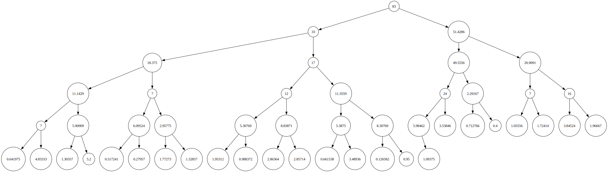

# Greedy and Dynamic Programming C++




## Compilation Instructions

This project uses CMake for building the executables. Make sure you have CMake and a C++ compiler installed.

### Steps

1. Create a build directory:
   ```sh
   mkdir build
   cd build
   ```

2. Run CMake to generate the build files:
   ```sh
   cmake ..
   ```

3. Build the project:
   ```sh
   make
   ```

### Executables

After building, you will have the following executables in the `build` directory:

- `custom_sort` &mdash; sorts a list of people by name and age
- `heap_sort` &mdash; demonstrates heap sort on a list of people
- `knapsack_heap` &mdash; sets up the knapsack problem using a heap

You can run them with:
```sh
./custom_sort
./heap_sort
./knapsack_heap
```
